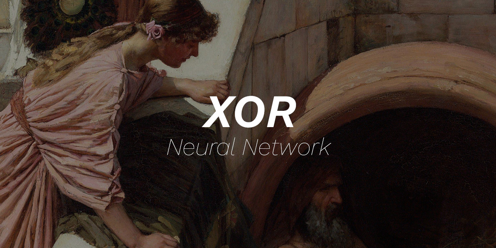

 

    
      
    
    
    
    
    
    

Language: <a href="readme.md">EN-US</a>

Prova de conceito de rede neural artificial para resolver o problema clássico (XOR).

Para executar, abra o arquivo html em seu navegador padrão ;)

Como na imagem ao lado, a rede neural possui 3 camadas, uma camada de entrada (para os padrões a serem analisados), uma camada oculta (para representar o aprendizado profundo) e uma camada de saída para conclusão.

A primeira camada possui 2 neurônios (nodes) para a entrada XOR, a segunda camada possui 5 neurônios (esta é a camada oculta), finalizando com 1 neurônio na camada de saída, representando a aproximação do resultado desejado.

**Se meu código te ajudou em algo, considere [ser um patrocinador](https://github.com/sponsors/melchisedech333) :blue_heart:** 

 

:smiley: Autor
---

Patrocinar: [melchisedech333](https://github.com/sponsors/melchisedech333) 
YouTube: [Melchisedech](https://www.youtube.com/channel/UC4Sh4wxncr5arnydpUfWPKw) 
Twitter: [Melchisedech333](https://twitter.com/Melchisedech333) 
Blog: [melchisedech333.github.io](https://melchisedech333.github.io/) 
LinkedIn: [Melchisedech Rex](https://www.linkedin.com/in/melchisedech-rex-724152235/)

 

:scroll: Licença
---

[ BSD-3-Clause license](./license)

  

## Lembre-se de deixar   uma linda estrelinha :star_struck:

